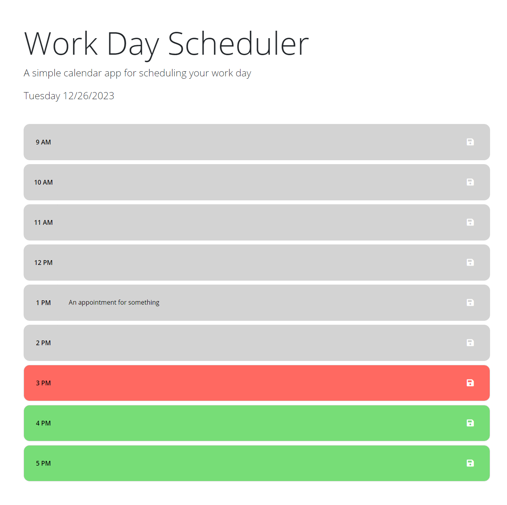

# work_day_scheduler

## Description
In this project I refactored code to make a functional work day scheduler. The application shows which hours have past, which hour it is, and future colors by color, it also has the ability to save data to the browser's local storage, allowing the browser to be reloaded or closed without the loss of your schedule.

## Repository 

Link to deployed code: 

## Technoligies
- This application used javascript, css, and html5
- Saving data to the browsers local storage

## Mockup

## Credits 
I used resources provided by the Rutgers University Bootcamp Course.

## Licensed 
This is under the MIT license.